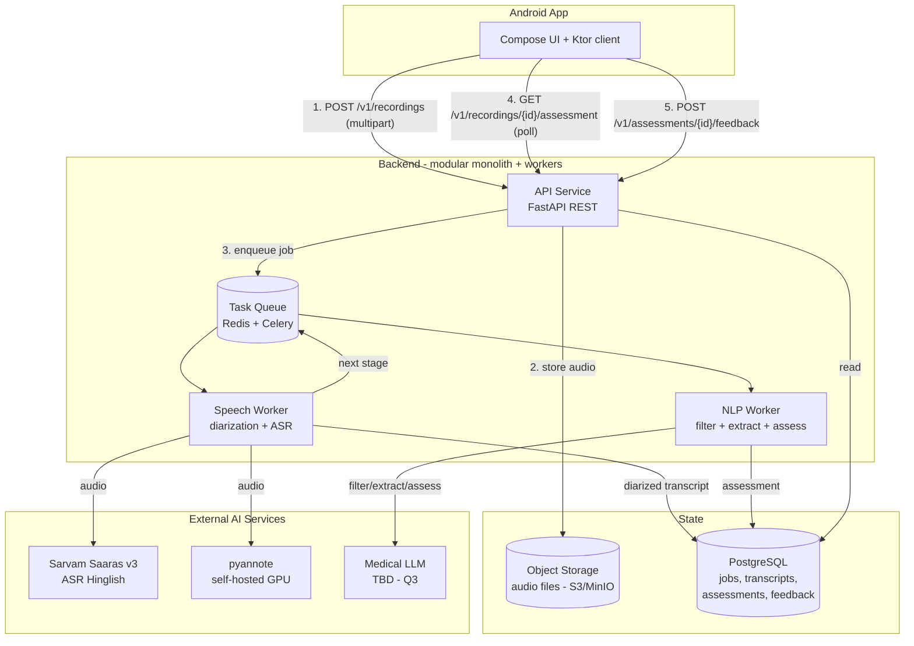

# Second Opinion — Backend Documentation

> **Purpose:** How the backend is structured: components, their interactions, services, tools,
> libraries, and the scaling best practices we follow. For product context see
> `docs/PROJECT_DOCUMENTATION.md`; for the Android client see `docs/ANDROID_APP.md`.

**Last updated:** 2026-07-24
**Status:** Steps 1–6 implemented — the pipeline runs end-to-end: upload → speech worker
(Sarvam Batch API, native diarization) → NLP worker (sarvam-30b relevance + extraction) →
assessment worker (sarvam-30b triage output as the interim answer to Q3); the Android app
is wired to this API (see `docs/ANDROID_APP.md` §5.2)

---

## 1. Guiding Principles

1. **Modular monolith first, microservices later.** One deployable API service + worker
   processes, organized into clean internal modules. Split into separate services only when a
   module has a proven independent scaling need (the GPU diarization worker is the first
   candidate). Avoids premature operational complexity.
2. **Async-first pipeline.** Audio processing takes seconds-to-minutes; the upload request must
   never block on it. Upload returns immediately with a job id; processing happens via a queue.
3. **Stateless services.** All state lives in PostgreSQL, object storage, and the queue —
   any API/worker instance can be killed or scaled horizontally at any time.
4. **12-factor config.** All configuration via environment variables; no secrets in code.
5. **Idempotency everywhere.** Uploads carry client-generated UUIDs; pipeline stages can be
   retried safely without duplicating work or data.
6. **Every AI stage is replaceable.** Diarization, ASR, and assessment are behind internal
   interfaces — vendors (Sarvam, pyannote, medical LLM) can be swapped per benchmark results
   without touching pipeline orchestration.
7. **Capture everything for the feedback loop.** Pharmacist accept/reject/override decisions
   and intermediate pipeline artifacts are stored — this is our evaluation and improvement data.

## 2. System Design



### 2.1 Components

| Component | Responsibility | Scaling unit |
|---|---|---|
| **API Service** | REST endpoints: upload, job status, assessment retrieval, feedback. Validation, persistence, enqueueing. No heavy compute. | Horizontal (stateless) |
| **Speech Worker** | Stage 1: pull job → fetch audio from object storage → diarize (pyannote) → transcribe segments (Sarvam API) → persist diarized transcript → enqueue stage 2 | Horizontal; GPU-bound if self-hosting diarization |
| **NLP Worker** | Stage 2: relevance-weight speakers, discard irrelevant segments, extract structured symptoms/demographics, call medical AI, persist assessment | Horizontal; I/O-bound (LLM API calls) |
| **Task Queue** | Decouples API from workers; retries, backoff, dead-letter queue | Redis (managed) |
| **PostgreSQL** | System of record: recordings metadata, pipeline state, transcripts, assessments, feedback | Managed (RDS/Cloud SQL); read replicas later |
| **Object Storage** | Raw audio files (`.m4a`), referenced by key from PostgreSQL — never store blobs in the DB | S3 / MinIO (dev) |
| **External AI** | Sarvam (ASR), pyannote (diarization, self-hosted or pyannoteAI API), medical LLM (TBD, open question Q3) | Per-vendor rate limits |

### 2.2 Processing pipeline state machine

Each recording moves through explicit states, persisted in PostgreSQL:

```
UPLOADED → QUEUED → DIARIZING → TRANSCRIBING → FILTERING → EXTRACTING → ASSESSING → COMPLETED
                                      │ (any stage)
                                      ▼
                              FAILED (with stage + error; retryable up to N times → DLQ)
```

Rules:
- State transitions are DB transactions — a job is never "in two states".
- Each stage stores its output artifact (transcript JSON, filtered text, extraction JSON,
  assessment JSON) so failures resume from the last completed stage, and every intermediate
  result is auditable (medical context demands traceability).
- Client polls `GET /v1/recordings/{id}` for status; push notifications (FCM) are a later
  optimization.

## 3. API Surface (v1 draft)

| Method | Path | Purpose |
|---|---|---|
| `POST` | `/v1/recordings` | Multipart upload: audio + metadata (client UUID, duration, locale, `consent_confirmed` — must be true, else `422`). Returns `202` + job id |
| `GET` | `/v1/recordings/{id}` | Pipeline status + stage |
| `GET` | `/v1/recordings/{id}/assessment` | Final assessment: `symptom_summary` (comma-joined extracted symptoms), condition categories + confidence, red flags, medicine guidance (prescription drugs labeled), disclaimer |
| `DELETE` | `/v1/recordings/{id}` | DPDP erasure: deletes the audio object + recording row (cascades to transcripts, extraction, assessment, feedback); owner-scoped; returns `204` |
| `POST` | `/v1/assessments/{id}/feedback` | Pharmacist decision: accepted / rejected / overridden + optional note |
| `GET` | `/v1/auth/me` | Validates the bearer token; auto-provisions the user (pharmacist role) on first call |
| `GET` | `/healthz`, `/readyz` | Liveness/readiness probes |

Conventions:
- URL-versioned API (`/v1/`); breaking changes require a new version.
- JSON everywhere except the multipart upload; errors follow RFC 9457 (Problem Details).
- Idempotency: `POST /v1/recordings` deduplicates on the client-generated recording UUID
  (per owner — another user re-uploading the same UUID gets `409`).
- Auth (Phase 4): Firebase sign-in (Google or email/password); the API verifies Firebase
  ID tokens (`Authorization: Bearer`) against the securetoken JWKS (issuer
  `https://securetoken.google.com/<SO_FIREBASE_PROJECT_ID>`, audience = the project id)
  and scopes recordings/assessments to their owner (cross-user access reads as `404`).
  The compose stack defaults to `SO_AUTH_PROVIDER=firebase` with
  `SO_FIREBASE_PROJECT_ID=pharmacy-opinion`; `SO_AUTH_PROVIDER=fake` accepts
  `fake:<uid>[:<email>[:<name>]]` tokens for local dev; health probes stay open.

## 4. Data Model (initial)

```
recordings      id (uuid, client-generated), audio_key, duration_ms, locale,
                consent_confirmed, status, failure_stage, audio_purged_at,
                created_at, updated_at
transcripts     id, recording_id FK, speaker_label, segment_index, text,
                start_ms, end_ms, relevance_weight, discarded (bool)
extractions     id, recording_id FK, symptoms (jsonb), age, gender, location,
                duration_days, severity, raw_llm_output (jsonb)
assessments     id, recording_id FK, conditions (jsonb: name + confidence),
                red_flags (jsonb), otc_guidance (jsonb), model_id, prompt_version,
                raw_llm_output (jsonb)
feedback        id, assessment_id FK, decision (accepted|rejected|overridden),
                note, created_at
```

Notes: `jsonb` for AI outputs (schemas evolve fast); `model_id` + `prompt_version` recorded on
every assessment for reproducibility and evaluation; Alembic manages migrations.

## 5. Tech Stack — Services, Tools & Libraries

**Language: Python.** The speech/ML ecosystem (pyannote, VAD tooling, evaluation libraries) is
Python-native, and every AI vendor ships a first-class Python SDK. A Kotlin/Ktor backend was
considered (team language consistency with the app) but rejected for the pipeline — it would
force us to shell out to Python for diarization anyway.

| Concern | Choice | Why |
|---|---|---|
| Web framework | **FastAPI** | Async-native, Pydantic validation, OpenAPI docs auto-generated, dominant Python API framework |
| ASGI server | **uvicorn** (behind a reverse proxy) | Standard FastAPI pairing |
| Validation / schemas | **Pydantic v2** | Request/response models + settings management |
| Task queue | **Celery + Redis** | Mature retries/backoff/DLQ semantics, huge community; Redis doubles as cache |
| ORM / migrations | **SQLAlchemy 2 + Alembic** | Standard; async support |
| Database | **PostgreSQL 16+** | `jsonb` for AI artifacts, strong consistency, managed offerings everywhere |
| Object storage client | **boto3 / MinIO SDK** | S3-compatible in prod and dev |
| HTTP client | **httpx** | Async calls to Sarvam / LLM APIs with timeouts + retries |
| Diarization | **pyannote.audio** (self-hosted GPU) | Primary candidate per project doc §6.2; pyannoteAI hosted API as fallback |
| ASR | **Sarvam Saaras v3 API** | Primary Hinglish candidate per project doc §6.1 |
| LLM orchestration | **Plain SDK calls + Pydantic structured output** | No LangChain-style framework for MVP — fewer abstractions, easier debugging; revisit if chains grow complex |
| Testing | **pytest + pytest-asyncio + testcontainers** | Real Postgres/Redis in integration tests |
| Lint/format | **ruff** | Single fast tool for lint + format |
| Packaging | **uv** | Fast, lockfile-based dependency management |
| Containers | **Docker + docker-compose (dev)** | One-command local stack: API, worker, Postgres, Redis, MinIO |
| CI | **GitHub Actions** | Lint → test → build image |

## 6. Scaling Best Practices

How the design scales, and the rules that keep it scalable:

1. **Separate compute profiles.** API (light, many instances), NLP worker (I/O-bound), speech
   worker (GPU-bound) scale independently — queue depth per stage is the autoscaling signal.
2. **Never block the request path.** Anything slower than a DB read goes through the queue.
   Upload → `202 Accepted` in <500ms regardless of pipeline load.
3. **Backpressure, not collapse.** Bounded queues; if the pipeline is saturated, uploads still
   succeed (audio is stored) and jobs wait — no cascading failures into the API.
4. **Timeouts, retries, circuit breakers on every external call.** Sarvam/LLM outages must
   degrade to "job delayed", never hang workers. Exponential backoff + jitter; DLQ after N
   retries with alerting.
5. **Cost control on AI calls.** Per-stage token/minute budgets, response caching where safe,
   and per-recording cost recorded in the DB — LLM spend is a first-class metric.
6. **Database discipline.** No blobs in Postgres (audio → object storage); indexes on
   `recordings.status` and FKs; pagination on all list endpoints; connection pooling (pgbouncer
   when needed).
7. **Stateless + immutable deploys.** Any instance is disposable; rolling deploys with
   readiness probes; DB migrations are backward-compatible one release back.
8. **Rate limiting at the edge** (reverse proxy) — protects the free-tier POC from abuse even
   before auth exists.

## 7. Observability

| Signal | Tool | Notes |
|---|---|---|
| Structured logs | JSON logs (structlog) — ✅ implemented | `recording_id` propagated through every pipeline stage |
| Metrics | Prometheus + Grafana | Queue depth, stage latency, stage failure rate, external API latency/cost |
| Tracing | OpenTelemetry | One trace per recording across API → queue → workers → external calls |
| Alerts | Grafana alerts | DLQ non-empty, stage p95 latency, external API error rate |

The single most important debugging question — "what happened to recording X?" — must be
answerable from logs/traces alone via `recording_id`.

Implemented baseline (`app/observability.py`): one structlog `ProcessorFormatter` on the
stdlib root logger, so structlog-native and library (uvicorn/celery/sarvamai) records all
render identically — JSON by default, `SO_LOG_FORMAT=console` for local dev. The API logs
an `http_request` event per request (method/path/status/duration). The worker replaces
Celery's logging via the `setup_logging` signal and binds `recording_id` + `task_id` to
contextvars per task (`task_prerun`/`task_postrun`), so every log line of every stage
carries them. Pipeline stages emit `stage_done` / `stage_failed` events with `stage` and
`duration_ms` — the log-based stand-in for metrics until Prometheus lands.

## 8. Security & Data Protection

POC explicitly skips authentication (project decision D6), but the following are non-negotiable
even in POC because we handle health data (DPDP Act 2023 — see project doc §9):

- **TLS everywhere** — no plaintext transport, including internal service-to-object-storage.
- **Encryption at rest** for object storage and database.
- **No health data in logs** — log IDs and metadata, never transcripts or audio content.
- **Consent, retention & erasure (DPDP, implemented)** — uploads require
  `consent_confirmed=true` (`422` otherwise; flag persisted on the recording);
  `DELETE /v1/recordings/{id}` erases the audio object and cascades the row deletion to
  transcripts, extraction, assessment, and feedback; a daily Celery-beat sweep
  (`worker/retention.py`) purges audio blobs + transcript rows older than
  `SO_RETENTION_DAYS` (default 30; `audio_purged_at` marks done, keeps it idempotent) —
  derived rows are kept for the pilot's quality loop until an erasure request.
- **Secrets** via environment/secret manager only; never in code, images, or logs.
- Auth (Phase 4, implemented): Firebase ID tokens (Google + email/password providers)
  verified server-side (`app/auth.py` `TokenVerifier` port: `firebase` | `fake`); `users` table
  with role enum (pharmacist/admin; patient/doctor roles later per decision D5);
  recordings carry `owner_id` and all data endpoints require the owner's token.

## 9. Environments & Deployment

| Env | Infra | Notes |
|---|---|---|
| **dev** | docker-compose: API + worker + Postgres + Redis + MinIO | One command up; external AI mocked or sandbox keys |
| **staging** | Single small VM or managed containers | Real external AI vendors, synthetic data only |
| **prod** | Managed containers (Cloud Run / ECS / K8s later), managed Postgres + Redis, S3 | GPU node/service only if self-hosting pyannote; else pyannoteAI API |

Deployment order of operations: containerize from day one; defer Kubernetes until worker
autoscaling demands it. India region hosting preferred (data locality + latency for target
users).

## 10. Build Order (Phase 2 kickoff)

1. ~~Repo scaffold: FastAPI app, Celery worker, docker-compose stack, CI~~ ✅
2. ~~`POST /v1/recordings` upload → object storage + DB row + queue stub~~ ✅
3. ~~Speech worker: pyannote + Sarvam integration~~ ✅ — Sarvam Saaras v3 Batch API bundles
   diarization with ASR (answers Q2), so single-vendor for the POC; pyannote deferred until
   real-audio quality says otherwise. ASR benchmarking still pending (needs keys + real audio)
4. ~~NLP worker: relevance filter + extraction with structured output~~ ✅ — two focused
   sarvam-30b calls (relevance weighting, then extraction from kept segments; sarvam-m is
   deprecated), prompted JSON + Pydantic validation; raw LLM replies stored in
   `extractions.raw_llm_output` for audit
5. ~~Assessment stage~~ ✅ — `Assessor` port with a general Sarvam chat model (sarvam-30b)
   as the POC provider: condition hypotheses + confidence, red flags, medicine guidance
   (OTC preferred; prescription drugs labeled, see §11 note);
   `model_id` + `prompt_version` + raw reply persisted per assessment. Q3 (dedicated
   medical LLM) stays open — the port makes it a drop-in swap after benchmarking
6. ~~Feedback endpoint + polling status endpoint~~ ✅ (feedback + status + assessment retrieval)
7. ~~Observability baseline (structured logs + queue/stage metrics)~~ ✅ — structlog JSON
   logs across API + worker, `recording_id`/`task_id` bound per task, `stage_done` /
   `stage_failed` events with per-stage `duration_ms` (log-based metrics; Prometheus is
   the next build-out per §7)

## 11. Implementation Inventory (current)

Layout: `backend/` — uv project, Python 3.12, single package `app/` + `worker/` entrypoint.

| Path | Purpose |
|---|---|
| `backend/pyproject.toml` | Dependencies (FastAPI, SQLAlchemy 2 async, Alembic, Celery, boto3), ruff + pytest config |
| `backend/app/main.py` | `create_app()` factory; RFC 9457 problem-details handler; router registration; `http_request` access-log middleware |
| `backend/app/settings.py` | `pydantic-settings`, `SO_`-prefixed env vars, working defaults for the compose stack |
| `backend/app/auth.py` | `TokenVerifier` port: `FirebaseTokenVerifier` (PyJWT + Firebase securetoken JWKS, needs `pyjwt[crypto]`; issuer + audience pinned to `SO_FIREBASE_PROJECT_ID`) / `FakeTokenVerifier` (`fake:<uid>[:<email>[:<name>]]` for dev/tests); `get_current_user` dependency auto-provisions `users` rows |
| `backend/app/observability.py` | structlog config shared by API + worker: JSON (or console) rendering for structlog and stdlib records alike |
| `backend/app/db.py` | `Base`, lazy async engine/session factory, `get_session` dependency |
| `backend/app/models.py` | `User` (Firebase UID + email + display name + role), `Recording` (client-UUID PK, `owner_id` FK, `consent_confirmed`, `audio_purged_at`), `TranscriptSegment`, `Extraction`, `Assessment`, `Feedback` (delete cascades from `Recording`); `RecordingStatus` state machine (§2.2); jsonb with SQLite-compatible variant |
| `backend/app/schemas.py` | Pydantic response/request models; `UserOut`; `AssessmentOut.symptom_summary` is derived from the `Extraction` row at read time (not stored on `assessments`) |
| `backend/app/storage.py` | `ObjectStorage` port + boto3 S3/MinIO impl (offloaded via `asyncio.to_thread`) |
| `backend/app/queue.py` | Celery factory + `enqueue` dependency; API enqueues by task name, never imports worker code |
| `backend/app/routers/` | `health` (healthz/readyz), `auth` (`/v1/auth/me`), `recordings` (consent-gated upload / status / assessment / DELETE erasure, owner-scoped), `assessments` (feedback, owner-scoped) |
| `backend/worker/main.py` | Celery worker entrypoint; speech + NLP + assessment stage tasks + daily retention-sweep beat schedule; structlog setup + per-task `recording_id` context binding |
| `backend/worker/transcription.py` | `Transcriber` port; `SarvamTranscriber` (Batch API, `with_diarization=True`) + `FakeTranscriber` (dev/demo, `SO_SPEECH_PROVIDER=fake`) |
| `backend/worker/nlp.py` | `NlpModel` port; `SarvamNlp` (sarvam-30b chat, prompted-JSON + Pydantic validation) + `FakeNlp` (`SO_NLP_PROVIDER=fake`); relevance + extraction prompts |
| `backend/worker/assessment.py` | `Assessor` port; `SarvamAssessor` (triage prompt: conditions + confidence, red flags, medicine guidance with `prescription: true/false` per item for Schedule H/H1) + `FakeAssessor` (`SO_ASSESSMENT_PROVIDER=fake`); `PROMPT_VERSION` recorded per assessment |
| `backend/worker/pipeline.py` | `run_speech_stage` (S3 download → transcribe → segments, `transcribing` → `filtering`) + `run_nlp_stage` (relevance weights/discard flags → `extracting` → Extraction row → `assessing`) + `run_assessment_stage` (extraction + kept transcript → Assessment row → `completed`); replace-on-retry persistence, failures set `failed` + stage; structured `stage_done`/`stage_failed` events with `duration_ms` |
| `backend/worker/retention.py` | DPDP retention sweep: purges audio objects + transcript rows of recordings older than `SO_RETENTION_DAYS`; `audio_purged_at` marks purged rows (idempotent); scheduled daily via Celery beat |
| `backend/worker/db.py` | Sync SQLAlchemy session for Celery tasks (psycopg driver on the same DB) |
| `backend/alembic/` | Async migrations; URL from settings; initial schema revision applied |
| `backend/tests/` | 50 pytest tests: API (fakes for storage/queue/token-verifier, httpx `ASGITransport`), auth (401s, `/me` provisioning, owner scoping), consent gate + erasure cascade + retention sweep, plus speech/NLP/assessment worker stage tests (sync SQLite, stub providers, Sarvam + LLM-JSON parsers) |
| `backend/docker-compose.yml` | api + worker + Postgres 16 + Redis 7 + MinIO (host ports 9100/9101) + bucket init; api runs `alembic upgrade head` on start |
| `.github/workflows/backend.yml` | CI: ruff check/format + pytest + Docker image build |

Verified end-to-end on the compose stack (fake providers): upload → 202 + MinIO object →
speech stage → diarized segments → NLP stage → relevance weights + discard flags on
`transcripts`, `extractions` row (symptoms/duration/severity + raw LLM audit payload) →
assessment stage → `assessments` row → status `completed`; idempotent re-upload returns 200.

Also verified against the **real Sarvam APIs** (`SO_SPEECH_PROVIDER=sarvam` /
`SO_NLP_PROVIDER=sarvam` / `SO_ASSESSMENT_PROVIDER=sarvam` + `SO_SARVAM_API_KEY`; compose
defaults to `fake`) with a synthesized two-voice Hindi pharmacy exchange: Saaras v3
transcribed and separated the speakers correctly, sarvam-30b identified the patient speaker
and extracted symptoms/age/duration accurately, and the assessment stage returned plausible
condition hypotheses with confidence plus medicine guidance, served via
`GET /v1/recordings/{id}/assessment`. Note: Sarvam chat models are reasoning models —
requests set `reasoning_effort="low"` and `max_tokens=4096`, or the budget is consumed
before the reply. Requirement change: prescription (Schedule H/H1) medicines are no
longer blocked — guidance items carry a model-declared `prescription: true/false` flag
that the app renders as a "prescription drug" label. Known gap: label correctness relies
on the prompt (no code-side schedule lookup), so mislabels are possible until an
evaluation set exists.

## 12. Related Documents

- `docs/PROJECT_DOCUMENTATION.md` — product context, decisions D1–D6, vendor comparisons, roadmap
- `docs/ANDROID_APP.md` — Android client architecture and upload flow (§5.2)
